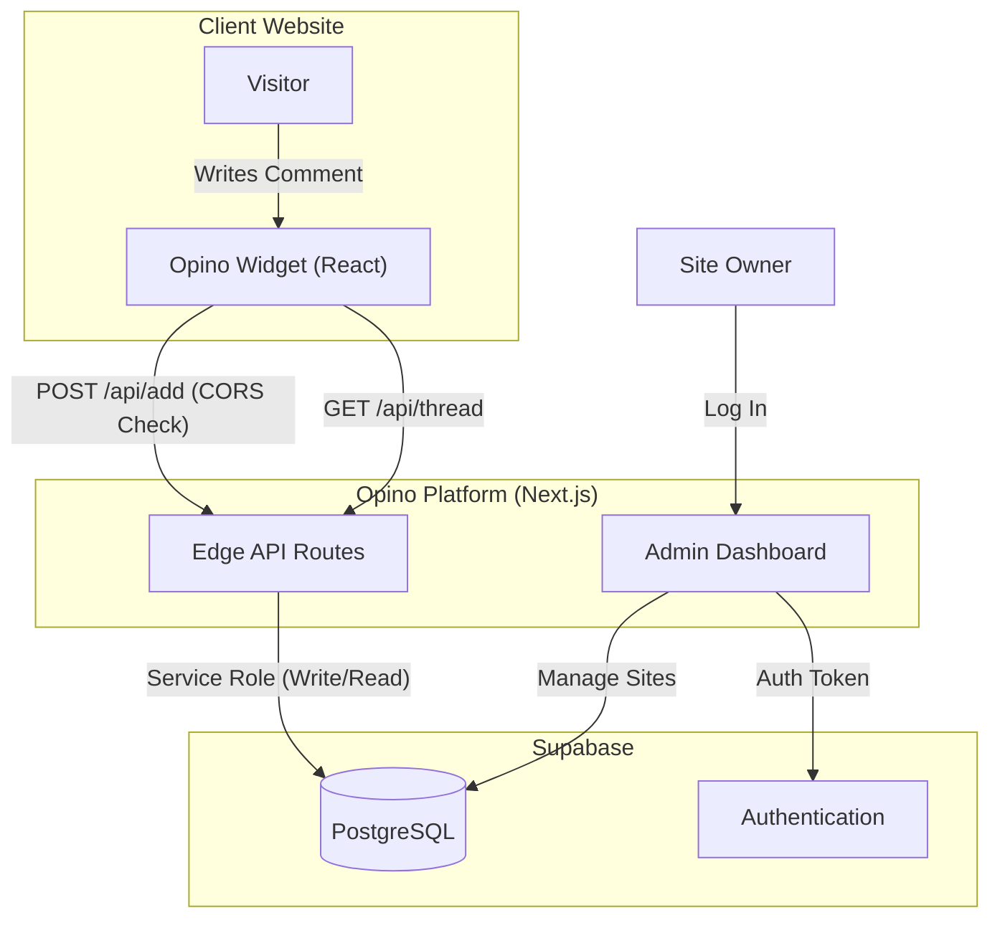

# Opino
**Privacy Focused Comment System for Static Websites**

Opino is a privacy-first, lightweight comment system designed specifically for static websites. It consists of a plug-and-play React widget and a secure, serverless backend.

## Project Overview

Opino solves the problem of adding dynamic comments to static sites (Jekyll, Hugo, Next.js SSG) without compromising user privacy or website performance.

*   **Privacy Focused**: No tracking cookies, no ads, no third-party data harvesting.
*   **Static Site Optimized**: Works with any HTML page via a simple embed code.
*   **Secure**: Built-in CORS protection and Supabase Row Level Security (RLS).
*   **Modern Stack**: React 17 Widget + Next.js 16 + Supabase.

## Documentation

The documentation is split into two parts:

*   **[Frontend Widget Documentation](WIDGET.md)**: Instructions for embedding the widget, configuration, and **CSS customization**.
*   **[Backend Platform Documentation](BACKEND.md)**: Guide for self-hosting the API, database schema, and dashboard usage.

## Architecture

Opino is built on a modern, serverless architecture designed for performance and security. It separates the presentation layer (Widget) from the logic and data layer (Platform).

### Core Components

1.  **Opino Widget (Client-Side)**
    *   **Technology**: React 17, Webpack.
    *   **Role**: A lightweight JavaScript bundle (`main.js`) embedded on the client's website. It handles the UI for displaying and posting comments.
    *   **Privacy**: Does not use cookies or local storage tracking.

2.  **Opino Platform (Server-Side)**
    *   **Technology**: Next.js 16 (App Router), Vercel Edge Functions.
    *   **Role**: Serves as the API gateway and Admin Dashboard.
    *   **API**: Exposes REST endpoints (`/api/thread`, `/api/add`) running on the Edge for low latency. Handles CORS validation to ensure requests originate from authorized domains.

3.  **Supabase (Infrastructure)**
    *   **Technology**: PostgreSQL, GoTrue (Auth).
    *   **Role**: Managed backend service.
    *   **Database**: Stores `sites` configuration and `comments` data.
    *   **Auth**: Handles authentication for Site Owners accessing the Dashboard.
    *   **Security**: Uses Row Level Security (RLS) to isolate data between different site owners.

### Data Flow



## Quick Start (Hosted)

The fastest way to get started is using the official hosted instance.

1.  **Register**: Sign up at [app.opino.ongclement.com](https://app.opino.ongclement.com).
2.  **Create Site**: Go to the Dashboard and click **"Add Site"**.
3.  **Get ID**: Copy the generated `SITE_ID`.
4.  **Embed**: Add this to your HTML:

```html
<!-- Container for comments -->
<div id="cmt" data-opino-site="YOUR_SITE_ID_HERE"></div>

<!-- Opino Script -->
<script src="https://cdn.opino.ongclement.com/main.js"></script>
```

For more details on configuration and styling, see the **[Widget Documentation](WIDGET.md)**.

## Development

### Prerequisites

- Node.js >= 18.0.0
- npm >= 8.0.0

### Setup

```bash
# Install root dependencies (widget build tools)
npm install

# Install app dependencies
cd opino-app && npm install --legacy-peer-deps
```

### Commands

All commands are run from the root directory:

| Command | Description |
|---------|-------------|
| `npm run dev` | Start widget watcher + Next.js dev server |
| `npm run build` | Build widget and Next.js app for production |
| `npm run start` | Start the Next.js production server |
| `npm run test` | Run tests |
| `npm run lint` | Run linting |

### Project Structure

```
opino/
├── index.js              # Widget source (React component)
├── index.css             # Widget styles
├── prod.config.js        # Webpack config for widget
├── dist/                 # Built widget bundle
│   └── main.js
└── opino-app/            # Next.js CMS Dashboard & API
    ├── src/
    │   ├── app/          # Next.js App Router
    │   │   ├── api/      # REST API endpoints
    │   │   └── ...       # Dashboard pages
    │   ├── components/
    │   └── lib/
    └── public/
        └── main.js       # Widget (copied during build)
```

## Project Status

*   **Version**: 1.0.0 (Widget), 0.1.0 (App)
*   **Status**: Active Maintenance.
*   **Roadmap**:
    *   [ ] Email notifications for new comments.
    *   [ ] Markdown support for comments.
    *   [ ] Admin moderation tools.
